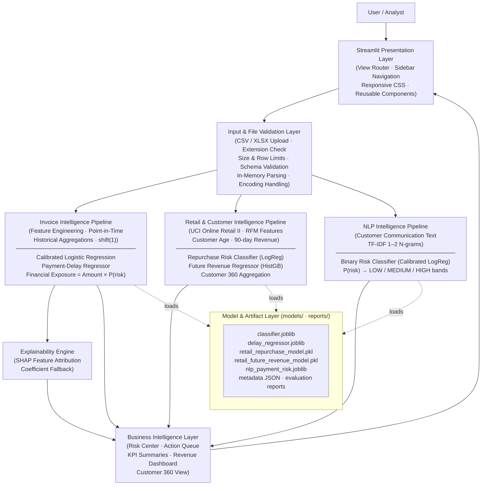

# InvoiceGuard AI

**Enterprise Receivables & Customer Intelligence Platform**

InvoiceGuard AI is a production-oriented AI/ML portfolio application combining invoice payment-risk prediction, customer behavioral analytics, revenue intelligence, explainable machine learning, and NLP-based payment-risk analysis. It is built with scikit-learn, XGBoost, and Streamlit.

- **Live Application:** [https://inovice-guard-ai-17.streamlit.app/](https://inovice-guard-ai-17.streamlit.app/)
- **GitHub Repository:** [https://github.com/Mohamed-Osama-ai7/Inovice-Guard-ai](https://github.com/Mohamed-Osama-ai7/Inovice-Guard-ai)

---

## Overview

B2B organizations face significant cash flow risk from late invoice payments. InvoiceGuard AI addresses this by:

- Predicting which open invoices are at risk of late payment before the due date.
- Estimating financial exposure (amount at risk) weighted by late probability.
- Providing customer-level behavioral intelligence (RFM, churn risk, revenue forecast).
- Flagging risk signals from customer payment communications using NLP.
- Explaining each prediction with SHAP feature attributions.

---

## Key Capabilities

- **Invoice Payment-Risk Prediction:** Binary classification scoring late-payment probability $P(\text{risk}) \in [0, 1]$.
- **Expected Payment Delay Estimation:** Regression model for anticipated delay days on at-risk invoices.
- **Financial Exposure Estimation:** Dollar-weighted exposure combining invoice amount and late-payment probability.
- **Customer 360 Analysis:** Unified view merging B2B invoice history with retail behavioral metrics (RFM, churn, revenue).
- **Customer Search:** Sub-10ms customer lookup and search.
- **Revenue Intelligence:** 60-day customer future revenue forecasting and repurchase risk classification.
- **Risk & Action Center:** Prioritized queue of high-risk accounts with recommended operational actions.
- **Explainable AI:** SHAP feature attribution showing top risk drivers per prediction.
- **NLP Payment-Risk Analysis:** Binary text classification of customer payment communications.
- **Batch Processing & Export:** Vectorized batch inference for CSV/XLSX uploads up to 50 MB with exportable results.
- **Data Quality & Validation:** Schema enforcement, missing value handling, and profiling diagnostics.
- **Responsive Interface:** CSS design system supporting Desktop, Laptop, Tablet, and Mobile viewports.

---

## System Architecture



**Data Flow Summary:**

1. User uploads a CSV/XLSX file or uses the live demo dataset.
2. The file validation layer checks extension, size, row count, schema, and encoding before any inference.
3. Feature engineering pipelines construct point-in-time safe features (no data leakage from future payment fields).
4. Models are loaded once at startup via `@st.cache_resource` and reused across all page navigations.
5. The vectorized batch inference pipeline runs all predictions in a single scikit-learn `.predict_proba()` call.
6. SHAP produces per-prediction feature attributions (with coefficient magnitude fallback for non-tree models).
7. The Business Intelligence layer aggregates results into risk queues, KPI cards, and customer profiles.
8. The Streamlit view router presents the appropriate page; the cached dataset is shared across navigation.

---

## Machine Learning

### Invoice Payment-Risk Model

The primary invoice model is a **Calibrated Logistic Regression** pipeline deployed as `models/classifier.joblib`.

> **Model Selection Context:** During training, multiple algorithms (Logistic Regression, Random Forest, XGBoost, MLP) were benchmarked. The `metadata.json` field `best_model: random_forest` records the highest raw-AUC algorithm in the selection comparison. The **deployed inference artifact** (`classifier.joblib`) is the isotonically calibrated Logistic Regression pipeline, chosen for its well-calibrated probabilities and strong OOT generalization.

| Property | Value |
|---|---|
| Algorithm | Calibrated Logistic Regression (`CalibratedClassifierCV`, isotonic, `cv="prefit"`) |
| Target | `late_payment` — Binary (0 = On Time, 1 = Late) |
| Split | Chronological: 60% Train / 20% Validation / 10% Test / 10% OOT |
| Leakage Controls | `payment_date` and `delay_days` excluded from $X$; historical features use `cumsum().shift(1)` |
| Test PR-AUC | 0.9751 |
| Test ROC-AUC | 0.9893 |
| Test Brier Score | 0.0372 |
| OOT PR-AUC | 0.9700 |
| OOT ROC-AUC | 0.9878 |
| OOT Brier Score | 0.0363 |
| Generalization | Strong temporal generalization on the evaluated OOT split. |

**Payment Delay Regression** (`models/delay_regressor.joblib`): Predicts expected delay days for invoices classified as late. MAE: 5.90 days, RMSE: 7.96 days on the test set.

### Retail & Customer Intelligence Models

Both models are trained on the UCI Online Retail II dataset using a chronological temporal split.

| Model | Algorithm | OOT ROC-AUC | OOT PR-AUC |
|---|---|---|---|
| Repurchase Risk (`retail_repurchase_model.pkl`) | Calibrated Logistic Regression | 0.7976 | 0.6668 |
| Future Revenue (`retail_future_revenue_model.pkl`) | HistGradientBoosting Regressor | R²: 0.5744 | MAE: 288.83 |

**Features:** RFM (Recency, Frequency, Monetary), cancellation rate, customer age, 90-day rolling revenue and orders. All features are computed from transactions strictly preceding the prediction snapshot date.

---

## NLP Payment-Risk Model

| Property | Value |
|---|---|
| Algorithm | TF-IDF (1–2 N-grams) + Calibrated Logistic Regression |
| Contract | **Binary** — Class 0: Low/No Payment Risk; Class 1: High Payment Risk |
| UI threshold mapping | LOW: $P < 0.30$ / MEDIUM: $0.30 \le P < 0.50$ / HIGH: $P \ge 0.50$ |

**MEDIUM is a business alert band applied at the UI layer, not a third learned class.**

**Evaluation Methodology:** Group-disjoint template split (zero template overlap across Train/Validation/Test) plus an independent held-out out-of-domain (OOD) evaluation corpus. Earlier reporting of $F_1 = 1.000$ was caused by template leakage in random splitting; the corrected methodology is used throughout.

| Split | Precision | Recall | F1 | Macro F1 | PR-AUC | ROC-AUC | Brier |
|---|---|---|---|---|---|---|---|
| Validation (Unseen Templates) | 0.5250 | 1.0000 | 0.6885 | 0.5875 | 0.7050 | 0.8401 | 0.2227 |
| Test (Unseen Templates) | 0.4375 | 1.0000 | 0.6087 | 0.4904 | 0.6829 | 0.8259 | 0.2742 |
| Held-Out OOD Corpus | 0.4286 | 0.9000 | 0.5806 | 0.5662 | 0.8118 | 0.8800 | 0.2318 |

The held-out OOD evaluation provides evidence of generalization beyond training templates. It is not a substitute for broad real-world validation on diverse production-labeled data.

---

## Dataset

### UCI Online Retail II (Retail & Customer Intelligence)

| Field | Value |
|---|---|
| Official Source | [https://archive.ics.uci.edu/dataset/502/online+retail+ii](https://archive.ics.uci.edu/dataset/502/online+retail+ii) |
| DOI | [https://doi.org/10.24432/C5CG6D](https://doi.org/10.24432/C5CG6D) |
| Citation | Chen, D. (2012). *Online Retail II*. UCI Machine Learning Repository. |
| Instances | 1,067,371 transactions — 01/12/2009 to 09/12/2011 |
| License | CC BY 4.0 |
| Acquisition | `python scripts/download_retail_data.py` |

The raw dataset is not committed to the repository (`data/raw/` is gitignored). The script downloads `online_retail_II.xlsx` directly from the UCI ML Repository.

### Kaggle Invoice Dataset (Invoice Payment-Risk Retraining)

The invoice payment-risk model is pre-trained on a synthetic demo dataset (`data/demo/`). To retrain on the real Kaggle B2B invoice dataset (CC BY-NC 4.0):

```bash
python scripts/download_data.py  # Requires Kaggle API credentials (kagglehub)
```

Running the application does not require this step.

---

## File Handling & Security

| Property | Value |
|---|---|
| Supported formats | CSV, XLSX |
| Maximum file size | 50 MB |
| Maximum rows | 1,000,000 |
| Extension validation | Yes — non-.csv/.xlsx rejected before parsing |
| Schema validation | Yes — missing required columns reported with a clear error message |
| Malformed file handling | Yes — corrupted, empty, and unparseable files rejected gracefully |
| In-memory processing | Yes — uploaded content is parsed in memory; no files are written to disk paths derived from uploaded filenames |
| Error presentation | Structured error messages only — no raw Python stack traces exposed to users |
| Secrets | No API keys, tokens, or passwords committed. `.env.example` contains placeholders only. `.gitignore` excludes `.env`, `.venv`, caches, and raw data. |

---

## Performance

All measurements are server-side execution timings in the development/test environment. They do not include browser rendering or network transfer latency.

| Operation | Benchmark Timing | Description |
|---|---|---|
| Overview Dataset (First Uncached Run) | 0.313 seconds | Vectorized batch inference |
| Overview Dataset (Cached Run) | 0.012 seconds | Cached Streamlit dataset rendering |
| Customer 360 Lookup | 2.49 ms | Indexed customer profile retrieval |
| Customer Search | 6.99 ms | Customer lookup/search |
| Single Invoice Prediction | 19.66 ms | Classification and SHAP scoring |
| Batch Prediction (12,000 rows) | 34.30 ms | Vectorized batch inference |
| NLP Single Message Prediction | 3.64 ms | TF-IDF scoring |

**Navigation performance:** Models and metadata are loaded once at application startup using `@st.cache_resource`. The dashboard dataset is computed once per session using `@st.cache_data` with an artifact-signature key. Subsequent page navigations reuse cached resources without reloading model artifacts or recomputing aggregations.

---

## Responsive Interface

The application CSS design system (`src/ui/css.py`) implements responsive behavior across:

- **Desktop (>= 1200px):** Multi-column KPI rows, full sidebar navigation, side-by-side analytical cards, interactive Plotly charts, and expanded dataframes.
- **Tablet (768px – 1199px):** Adaptive 2×2 grid layouts, auto-scaling charts, and touch-friendly controls.
- **Mobile (< 768px):** Single-column vertical card stacks, fluid typography (`clamp()`), horizontal table scrolling, 44px minimum touch targets, and no page-wide horizontal overflow.

*Responsive behavior was implemented via CSS design system inspection and application-level verification. Automated browser/device interaction testing was not available in the validation environment.*

---

## Testing & Quality Assurance

| Check | Result |
|---|---|
| `pytest tests/ -v` | 25 PASSED, 1 MODULE SKIPPED |
| Python compilation (`compileall`) | Clean — 0 errors |
| Startup smoke test | `STARTUP OK` |
| Vectorized inference equivalence | Max difference: 0.0000 |

The skipped module (`tests/test_api.py`, 7 tests) requires `httpx>=0.23.0`, which is listed in `requirements.txt`. These tests are skipped gracefully when `httpx` is unavailable in restricted environments (e.g., corporate SSL-filtered pip) and pass fully in standard environments.

---

## Repository Structure

```text
Inovice-Guard-ai/
├── app.py                          # Streamlit application entry point & view router
├── requirements.txt                # Pinned runtime dependencies
├── .env.example                    # Environment variable template (placeholders only)
├── src/
│   ├── api.py                      # FastAPI REST endpoints (/predict, /health, /metrics)
│   ├── audit_data.py               # Data audit CLI script
│   ├── customer_360.py             # Customer 360 profile builder
│   ├── model_registry.py           # Model metadata loader & registry
│   ├── pipeline.py                 # Invoice feature engineering pipeline
│   ├── retail_pipeline.py          # UCI retail dataset pipeline & feature engineering
│   ├── retail_train.py             # Retail model training script
│   └── ui/
│       ├── components.py           # Reusable UI component library
│       ├── css.py                  # Responsive enterprise CSS design system
│       ├── data.py                 # Vectorized dashboard dataset loader & caching
│       ├── navigation.py           # Sidebar & view router
│       └── views/                  # Page view modules
│           ├── overview.py         # Overview dashboard
│           ├── receivables.py      # Invoice risk & collections center
│           ├── customer_360.py     # Customer 360 profile view
│           ├── customer_search.py  # Customer search
│           ├── revenue_intelligence.py # Revenue forecasting & repurchase risk
│           ├── ai_insights.py      # NLP payment-risk analysis
│           └── system.py           # Model diagnostics & system health
├── models/                         # Serialized model artifacts (.joblib, .pkl, .json)
├── scripts/                        # Data download, model training, and evaluation scripts
├── reports/                        # Generated JSON metrics and evaluation reports
├── data/
│   └── demo/                       # Synthetic demo invoice dataset (committed)
├── docs/                           # Model cards, quality reports, leakage audit
└── tests/                          # Automated unit & integration test suite (7 files)
```

---

## Quickstart

### 1. Clone

```bash
git clone https://github.com/Mohamed-Osama-ai7/Inovice-Guard-ai.git
cd Inovice-Guard-ai
```

### 2. Create Virtual Environment

```bash
python -m venv .venv
# Linux/macOS:
source .venv/bin/activate
# Windows:
.venv\Scripts\activate
```

### 3. Install Dependencies

```bash
pip install -r requirements.txt
```

### 4. Run Application

The application ships with a pre-trained demo model and synthetic demo data. No dataset download is required to run.

```bash
streamlit run app.py
```

Open [http://localhost:8501](http://localhost:8501) in your browser.

### 5. Dataset Download (Optional — for Retraining)

```bash
# UCI Online Retail II (customer analytics modules):
python scripts/download_retail_data.py

# Kaggle B2B invoice dataset (invoice model retraining — requires Kaggle API credentials):
python scripts/download_data.py
```

### 6. Run Tests

```bash
python -m pytest tests/ -v
python -m compileall src/ app.py scripts/
python -c "from src.ui.views.overview import render_overview; from app import main; print('STARTUP OK')"
```

---

## Limitations

- **NLP evaluation scope:** The held-out OOD evaluation demonstrates generalization beyond training templates, but the corpus is limited in size. This is not a substitute for broad real-world validation on production-labeled customer communications.
- **Invoice model dataset:** The deployed model artifact (`classifier.joblib`) is trained on a synthetic demo dataset. Retraining on the full Kaggle B2B invoice dataset is required for production use with real invoice data.
- **Benchmark timings are environment-specific:** Development/test machine timings. Streamlit Cloud instance performance may differ.
- **Responsive UI validation:** Responsive design was implemented and audited via CSS inspection. Automated browser/device interaction testing was not available.
- **Predictions are decision-support signals:** Risk scores and exposure estimates are probabilistic outputs and should be interpreted as decision-support tools, not financial guarantees.
- **FastAPI REST API:** The `src/api.py` REST API is functional and tested locally, but it is not deployed as a public endpoint. The live application at the deployment URL is the Streamlit UI.

---

## License & Attribution

- **Source Code:** Released under repository terms.
- **UCI Online Retail II Dataset:** Licensed under Creative Commons Attribution 4.0 International (CC BY 4.0). Citation: Chen, D. (2012). *Online Retail II*. UCI Machine Learning Repository. DOI: [10.24432/C5CG6D](https://doi.org/10.24432/C5CG6D).
- **Kaggle Invoice Dataset:** CC BY-NC 4.0 (Kaggle listing). Not redistributed in this repository.