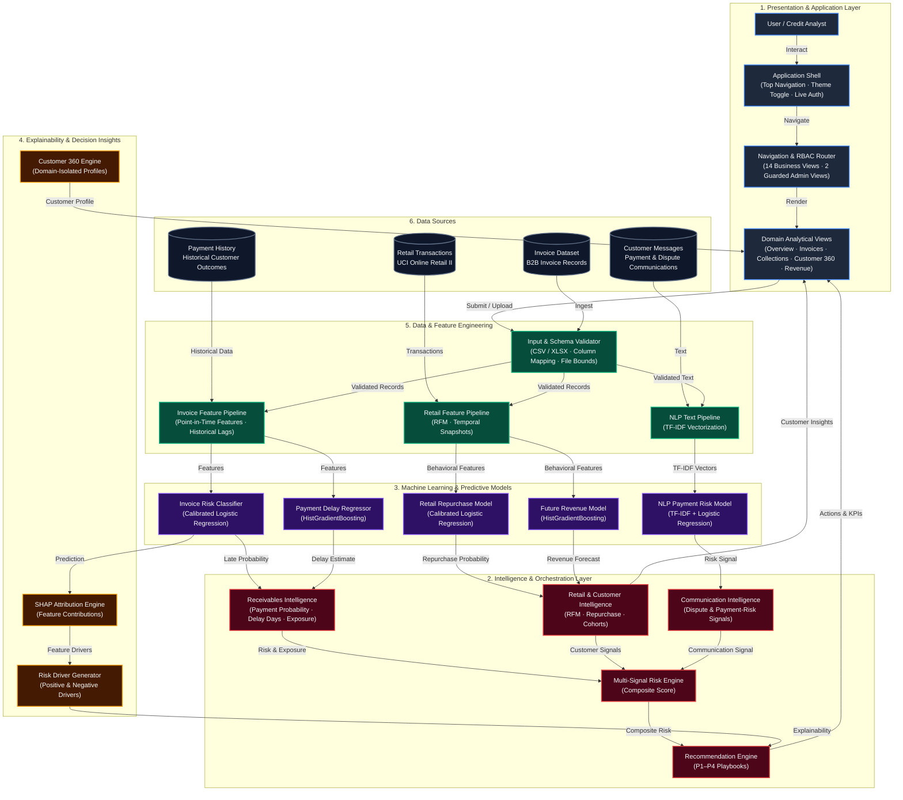

# InvoiceGuard AI

**Enterprise Receivables Intelligence, Multi-Signal Payment Risk & Cash-Flow Protection Platform**

[](https://inovice-guard-ai-17.streamlit.app/)
[](https://github.com/Mohamed-Osama-ai7/Inovice-Guard-ai)
[](https://www.python.org/)
[](https://scikit-learn.org/)
[](https://xgboost.readthedocs.io/)
[](https://creativecommons.org/licenses/by/4.0/)

InvoiceGuard AI is an enterprise-grade AI fintech and cash-flow protection platform designed to detect late-payment risks before due dates, quantify dollar-weighted exposure, forecast forward customer revenue, analyze payment communications using NLP, and provide deterministic, explainable operational guidance.

- **Live Application:** [https://inovice-guard-ai-17.streamlit.app/](https://inovice-guard-ai-17.streamlit.app/)
- **GitHub Repository:** [https://github.com/Mohamed-Osama-ai7/Inovice-Guard-ai](https://github.com/Mohamed-Osama-ai7/Inovice-Guard-ai)

---

## Business Problem

In B2B commerce, late invoice payments create systemic cash-flow volatility, increase working-capital financing costs, and force credit teams into reactive dispute resolution. Credit controllers often lack forward-looking intelligence to distinguish between low-risk administrative delays and high-risk default patterns before invoices become severely past due.

InvoiceGuard AI solves this by transforming static billing data and customer communications into proactive, explainable risk intelligence, allowing finance teams to intervene early, protect working capital, and optimize receivables collections.

---

## What InvoiceGuard AI Does

The platform executes an end-to-end intelligence workflow:

$$\text{Invoice + Customer + Payment Data} \longrightarrow \text{Validation} \longrightarrow \text{Feature Engineering} \longrightarrow \text{Risk Models} \longrightarrow \text{Explainability} \longrightarrow \text{Decisions}$$

1. **Ingests & Validates**: Ingests invoice terms, customer profiles, payment records, and communication text through in-memory, schema-validated pipelines.
2. **Engineers Point-in-Time Features**: Derives leakage-free temporal signals, historical payment ratios via expanding windows, and RFM behavioral metrics.
3. **Scores Late-Payment Probability**: Quantifies $P(\text{late}) \in [0, 1]$ using isotonically calibrated classification.
4. **Estimates Delay Horizon**: Predicts expected delay days on delinquent accounts using gradient-boosted regression.
5. **Evaluates Communication Signals**: Scans customer payment emails and notes for dispute or delinquency indicators using NLP.
6. **Quantifies Financial Exposure**: Computes dollar-weighted value at risk: $\text{Exposure} = \text{Invoice Amount} \times P(\text{late})$.
7. **Explains Predictions (SHAP)**: Isolates top positive and negative risk contributors for every prediction.
8. **Synthesizes Multi-Signal Score**: Aggregates invoice, behavioral, cancellation, and NLP signals into a 0–100 composite risk score.
9. **Delivers Actionable Playbooks**: Triggers deterministic P1–P4 operational recommendations and presents results via a modern fintech dashboard.

---

## Key Capabilities

- **Invoice Payment-Risk Classification**: Isotonically calibrated binary classification predicting late payment likelihood ($P(\text{risk}) \in [0, 1]$).
- **Payment Delay Regression**: Gradient-boosted regression estimating anticipated delinquency days for at-risk accounts.
- **NLP Payment-Risk Intelligence**: Text classification analyzing customer payment communications to detect disputes, cash shortages, and delay signals.
- **Customer 360 Analysis**: Comprehensive analytical view providing financial exposure, historical delinquency ratios, and transaction behavior under strict domain isolation.
- **Customer Search**: Sub-10ms indexed customer lookup across portfolio accounts.
- **Receivables Intelligence**: Prioritized collections queues categorized by aging status, exposure, and late probability.
- **Revenue Intelligence**: 60-day forward revenue regression and customer repurchase risk prediction.
- **Retail & Customer Analytics**: Data-driven customer cohort segmentation ($K=4$) and product purchasing intelligence derived from 1.06M transaction records.
- **SHAP Explainability**: Transparent local feature attributions isolating key drivers behind every risk score.
- **Financial Exposure Insights**: Real-time dollar-weighted cash-at-risk aggregation across portfolio segments.
- **Deterministic Action Playbooks**: Priority-tiered (P1–P4) operational playbooks generated from explicit business thresholds.
- **Batch Processing & In-Memory Parsing**: Vectorized batch inference supporting user-uploaded CSV/XLSX files up to 50 MB.
- **REST API**: Programmatic FastAPI endpoints for single-invoice inference, retail predictions, and risk evaluation.
- **Authentication & RBAC**: PBKDF2-HMAC-SHA256 session-state authentication guarding administrative diagnostic tools.
- **Modern Fintech UI**: Dual-theme design system (Light & Dark modes) featuring centralized CSS tokens, application shell bar, and theme-adaptive Plotly charts.

---

## System Architecture

### InvoiceGuard AI — High-Level Application & AI Architecture
**Scope:** Presentation $\longrightarrow$ Intelligence $\longrightarrow$ Models $\longrightarrow$ Explainability $\longrightarrow$ Data



#### Architecture Legend
- <span style="color:#3B82F6; font-weight:bold;">Blue (Application Layer)</span>: Streamlit frontend, application shell header, theme toggle, and RBAC router.
- <span style="color:#8B5CF6; font-weight:bold;">Purple (Machine Learning Models)</span>: Deployed scikit-learn classification and regression artifacts.
- <span style="color:#10B981; font-weight:bold;">Green (Data & Features)</span>: Ingestion validators, point-in-time windowing, and preprocessors.
- <span style="color:#F59E0B; font-weight:bold;">Orange (Explainability)</span>: SHAP attribution, top risk drivers, and customer profile engine.
- <span style="color:#EF4444; font-weight:bold;">Red (Risk & Decisions)</span>: Multi-signal risk engine, exposure calculation, and P1–P4 action playbooks.
- <span style="color:#64748B; font-weight:bold;">Slate (Data Sources)</span>: B2B invoice dataset, customer history, retail transactions, and communication logs.
- **Solid Arrow (`-->|Label|`)**: Primary execution and data dependency flow with explicit directional intent.

---

## End-to-End Data Flow

1. **Client Interaction / Ingestion**: An analyst interacts with the application shell or submits an invoice dataset via file upload.
2. **Validation & Security**: The input is validated against schema definitions (types, bounds, missing columns) and size restrictions (< 50 MB) entirely in memory.
3. **Feature Generation**: Temporal features (`days_to_due`, `invoice_month`, `invoice_quarter`) and historical behavior (`prior_late_count`, `prior_late_ratio`, `prior_avg_delay`) are extracted using expanding window lags (`cumsum().shift(1)`), preventing target leakage.
4. **Predictive Inference**: Pre-loaded model pipelines execute inference in sub-second vectorized operations:
   - Late-payment classifier generates calibrated probability $P(\text{late})$.
   - Delay regressor calculates predicted delay days.
   - NLP model vectors text and generates dispute probability.
   - Retail models generate repurchase probability and future revenue forecasts.
5. **SHAP & Attribution**: Feature importances are computed to identify positive and negative risk contributors.
6. **Multi-Signal Risk Synthesis**: The composite risk engine blends all active signals into a single 0–100 score and assigns priority playbooks (P1 Critical to P4 Routine).
7. **Presentation**: The responsive, theme-aware dashboard displays metrics, interactive Plotly charts, and drill-down customer tables.

---

## AI & Machine Learning Models

The platform deploys four distinct machine learning pipelines, each designed for specific operational risk domains:

### 1. Invoice Payment-Risk Classifier (`models/classifier.joblib`)
- **Task**: Binary classification predicting whether an invoice will be paid late ($>0$ days past due date).
- **Algorithm**: `CalibratedClassifierCV` wrapping `LogisticRegression(class_weight="balanced", max_iter=3000)` with isotonic probability calibration (`cv="prefit"`).
- **Features (17 total)**:
  - *Numeric (13)*: `invoice_amount_clean`, `amount_log1p`, `days_to_due`, `invoice_year`, `invoice_month`, `invoice_quarter`, `invoice_dayofweek`, `customer_seen_before`, `customer_is_new`, `prior_late_count`, `prior_late_ratio`, `prior_avg_delay`, `outstanding_amount`.
  - *Categorical (4)*: `industry`, `company_size`, `payment_method`, `customer_segment`.
- **Model Selection Context**: Multiple candidate architectures were benchmarked during selection (`Logistic Regression`, `Random Forest`, `MLP`, `XGBoost`). While `random_forest` achieved high raw accuracy (94.50%, F1: 90.82%), the isotonically calibrated Logistic Regression pipeline was chosen for deployment due to superior probability calibration (Brier score: 0.0363) and out-of-time stability (OOT PR-AUC: 0.9700).

### 2. Payment Delay Regressor (`models/delay_regressor.joblib`)
- **Task**: Continuous estimation of delinquency days on invoices identified as late.
- **Algorithm**: `HistGradientBoostingRegressor(l2_regularization=0.25, learning_rate=0.04, max_iter=400, random_state=42)`.
- **Preconditioning**: Fitted exclusively on historical invoices with positive payment delays, preventing negative-skew distortion.
- **Performance**: Test MAE of **5.90 days** and RMSE of **7.96 days** across 529 delayed test invoices.

### 3. NLP Payment-Risk Model (`models/nlp_payment_risk.joblib`)
- **Task**: Binary classification of customer communication text (emails, call notes, dispute logs) to detect payment risk.
- **Algorithm**: `TfidfVectorizer(ngram_range=(1,2), sublinear_tf=True, max_features=3000)` + `CalibratedClassifierCV(LogisticRegression(class_weight="balanced"))`.
- **Evaluation Methodology**: Group-disjoint template evaluation (zero template overlap between Train, Validation, and Test splits) and an independent real-world held-out OOD evaluation corpus.
- **Operational UI Alert Bands**:
  - `LOW`: $P(\text{risk}) < 0.30$
  - `MEDIUM`: $0.30 \le P(\text{risk}) < 0.50$ (Operational alert threshold applied at the UI layer)
  - `HIGH`: $P(\text{risk}) \ge 0.50$
- **OOD Generalization**: Achieves **0.9000 Recall** and **0.8800 ROC-AUC** on the independent held-out evaluation corpus.

### 4. Retail Repurchase & Inactivity Classifier (`models/retail_repurchase_model.pkl`)
- **Task**: Binary classification predicting customer repurchase within a 60-day forward horizon.
- **Algorithm**: Calibrated Logistic Regression (Isotonic calibration).
- **Features (8)**: `recency_days`, `customer_age_days`, `frequency`, `monetary`, `avg_order_value`, `cancellation_rate`, `revenue_90d`, `orders_90d`.
- **Performance**: Test PR-AUC: **0.6478**, OOT PR-AUC: **0.6668**, OOT ROC-AUC: **0.7976**, Brier Score: **0.1682**.

### 5. Future Revenue Regressor (`models/retail_future_revenue_model.pkl`)
- **Task**: Continuous forecasting of net customer spend (in GBP) over a 60-day forward window.
- **Algorithm**: `HistGradientBoostingRegressor`.
- **Performance**: Test MAE: **£236.21** ($R^2$: 0.5617), Out-of-Time (OOT) MAE: **£288.84** ($R^2$: 0.5744).

### 6. Multi-Signal Composite Risk Engine (`src/risk_engine.py`)
The business risk layer combines individual probabilistic signals into a calibrated 0–100 composite risk score:

$$\text{Composite Risk} = \sum_{i=1}^{k} \frac{w_i}{\sum w} \cdot s_i \times 100$$

Where active signals include:
- **Invoice Late Probability** ($w=0.40$): Calibrated model probability.
- **Customer Inactivity Probability** ($w=0.35$): $1.0 - P(\text{repurchase})$.
- **Cancellation Friction** ($w=0.15$): Scaled return/cancellation ratio.
- **Financial Exposure Ratio** ($w=0.20$): Ratio of outstanding balance to invoice amount.
- **NLP Dispute Signal** ($w=0.25$): Risk score derived from communication text.

---

## Explainability Layer (SHAP)

InvoiceGuard AI integrates model explainability directly into the credit analyst workflow:

- **Attribution Engine**: Computes local feature attributions using SHAP (`TreeExplainer` or linear coefficient attribution fallback).
- **Feature Impact Normalization**: Translates raw mathematical attributions into intuitive directional contributors (features increasing risk vs. features mitigating risk).
- **Human-Readable Business Drivers**: Converts technical weights into natural language summaries (e.g., *"Customer historical late ratio of 65% adds +18.4% to late probability; payment terms of Net-30 provide slight mitigating balance"*).
- **Visual Attribution Bars**: Visualized via color-coded horizontal bars within the Streamlit UI, allowing credit analysts to understand the rationale behind every risk score before taking action.

---

## Datasets & Feature Engineering

### 1. Primary B2B Invoice Dataset (`data/demo/demo_invoices.csv`)
- **Volume**: 12,000 commercial invoice records.
- **Target Distribution**: 8,196 on-time (68.3%), 3,804 late (31.7%).
- **Target Variables**:
  - `late_payment`: Binary indicator ($1$ if `delay_days > 0`, $0$ otherwise).
  - `delay_days_positive`: Continuous days late ($\max(0, \text{delay\_days})$).
- **Split Strategy**: Chronological split (60% Train, 20% Validation, 10% Test, 10% Out-of-Time).
- **Leakage Prevention**:
  - `payment_date`, `delay_days`, and derived outcome fields are strictly excluded from feature space $X$.
  - Historical behavioral features (`prior_late_count`, `prior_late_ratio`, `prior_avg_delay`) are computed using customer-level expanding windows lagged by one period (`shift(1)`).
  - New customers with zero historical invoices receive cold-start indicators (`customer_is_new = 1`) with zero prior defaults.
- **Handled Missing Data**: Cleaned and imputed via median (numeric) and most frequent (categorical) strategies:
  - `industry`: 180 missing
  - `payment_method`: 144 missing
  - `invoice_amount`: 120 missing
  - `company_size`: 120 missing

### 2. UCI Online Retail II Dataset
- **Source**: Official UCI Machine Learning Repository (Chen, 2012, CC BY 4.0).
- **Raw Volume**: 1,067,371 transactions across two reporting years (2009–2011).
- **Data Quality Audit**:
  - Duplicate rows identified: 34,335 (3.22%).
  - Records lacking Customer ID: 243,007 (22.77% — preserved for transaction-level product intelligence, excluded from customer-level RFM models).
  - Cancellations (prefix 'C'): 19,494 (1.83% — engineered into behavioral cancellation rates).
  - Clean behavioral transactions: 779,495 records across 5,942 distinct customers in 43 countries.
- **Temporal Snapshot Engineering**: Point-in-time rolling snapshot frames ($[T-90, T)$ feature windows vs. $[T, T+60)$ target windows), guaranteeing zero forward leakage.

### 3. Strict Domain Isolation Guarantee
- **B2B Receivables Domain**: Commercial credit accounts identified by `C-XXXX` (e.g. `C-0161`), containing contractual payment terms, outstanding balances, and aging brackets.
- **UCI Online Retail Domain**: Transactional retail accounts identified by numeric IDs (e.g. `13085`), containing order frequency, basket monetary value, and product lines.
- **Zero Identity Synthesis**: The platform enforces strict domain separation. Accounts are never artificially merged or resolved, preserving auditability and data integrity.

---

## Model Performance Summary

Empirical metrics measured across independently evaluated holdout splits:

### Classification Models
| Model Domain | Algorithm | Split | Precision | Recall | F1 | PR-AUC | ROC-AUC | Brier Score |
| :--- | :--- | :--- | :--- | :--- | :--- | :--- | :--- | :--- |
| **Invoice Payment Risk** | Calibrated LogReg (`classifier.joblib`) | **Test** | 0.9616 | 0.8870 | 0.9228 | **0.9751** | **0.9893** | 0.0372 |
| **Invoice Payment Risk** | Calibrated LogReg (`classifier.joblib`) | **OOT** | 0.9491 | 0.8809 | 0.9137 | **0.9700** | **0.9878** | 0.0363 |
| **Invoice (Benchmark)** | Random Forest (`random_forest.joblib`) | Test | 0.8909 | 0.9263 | 0.9082 | 0.9787 | 0.9893 | — |
| **Retail Repurchase** | Calibrated LogReg (`retail_repurchase_model.pkl`) | **Test** | 0.7175 | 0.4088 | 0.5208 | **0.6478** | **0.8133** | 0.1460 |
| **Retail Repurchase** | Calibrated LogReg (`retail_repurchase_model.pkl`) | **OOT** | 0.7387 | 0.3959 | 0.5155 | **0.6668** | **0.7976** | 0.1682 |
| **NLP Communication Risk** | TF-IDF + LogReg (`nlp_payment_risk.joblib`) | Unseen Test | 0.4375 | 1.0000 | 0.6087 | 0.6829 | 0.8259 | 0.2742 |
| **NLP Communication Risk** | TF-IDF + LogReg (`nlp_payment_risk.joblib`) | **Held-Out OOD** | 0.4286 | 0.9000 | 0.5806 | **0.8118** | **0.8800** | 0.2318 |

### Regression Models
| Model Domain | Algorithm | Split | MAE | RMSE | $R^2$ Score | Evaluation Subset |
| :--- | :--- | :--- | :--- | :--- | :--- | :--- |
| **Payment Delay** | HistGradientBoosting (`delay_regressor.joblib`) | **Test** | **5.90 days** | 7.96 days | — | 529 delayed invoices |
| **Future Revenue (60d)**| HistGradientBoosting (`retail_future_revenue_model.pkl`) | **Test** | **£236.21** | £895.87 | 0.5617 | Held-out retail test split |
| **Future Revenue (60d)**| HistGradientBoosting (`retail_future_revenue_model.pkl`) | **OOT** | **£288.84** | £1301.68 | 0.5744 | Out-of-time future split |

---

## Application & User Interface

The application features a modern AI fintech user interface built on a centralized CSS design token architecture (`src/ui/css.py`).

### Dual-Theme Engine (Light & Dark Modes)
- **Dark Theme (Default)**: Deep slate/navy palette (`#0B1120`, `#0F172A`, `#111827`, `#1E293B`, `#263449`, `#3B82F6`) designed for extended operational review.
- **Light Theme**: Clean, high-contrast financial analytics palette (`#F8FAFC`, `#FFFFFF`, `#E2E8F0`, `#0F172A`, `#2563EB`).
- **Instant Persistence**: Toggled via the top navigation shell or sidebar button; persists across all page navigations via `st.session_state.theme`.

### Top Application Shell Header
- **Branding & Breadcrumb**: Prominent SVG brandmark, application title, and hierarchical page context (`WORKSPACE / SECTION / PAGE`).
- **Header Theme Switcher**: 1-click toggle button (`☀️ Light` / `🌙 Dark`).
- **Live Role Indicator**: Accessible status pill indicating operational authorization level (`Analyst` or `Admin`).

### User-Facing Navigation Hierarchy (16 Pages)
```
DASHBOARD
  └── Overview                 # Executive cash-flow KPIs, risk distribution & receivables mix
RECEIVABLES
  ├── Invoices                 # Single invoice prediction, what-if simulator & batch CSV uploads
  └── Collections              # Prioritized delinquent accounts & days overdue tracking
CUSTOMERS
  ├── Customer 360             # Deep-dive profile explorer with strict domain isolation
  ├── Customer Search          # Instant index lookup across portfolio customer IDs
  ├── Customer Risk            # Risk matrix quadrant and portfolio exposure mapping
  └── Customer Segmentation   # K=4 KMeans cohort segmentation (Champions, Growing, At-Risk, Dormant)
INTELLIGENCE
  ├── Risk Drivers             # Global SHAP feature importances & risk-driver explanations
  ├── Message Intelligence     # NLP payment communication scoring & dispute detection
  └── Product Intelligence     # UCI retail SKU rankings, revenue concentration & return rates
REVENUE
  ├── Revenue Forecast         # 60-day customer forward revenue prediction
  ├── Customer Retention       # Repurchase probability & inactivity risk classification
  └── Revenue at Risk          # Financial exposure aggregation weighted by late probability
ADMINISTRATION (Guarded by ROLE_ADMIN)
  ├── Data Quality             # Ingestion schema validation, null profiling & empirical distributions
  └── System Status            # Model artifact signatures, memory diagnostics & server health
```

---

## REST API Reference

InvoiceGuard AI includes a high-performance REST API (`src/api.py`) powered by FastAPI:

> **Deployment Note:** Streamlit Cloud hosts the primary interactive dashboard. The FastAPI service provides programmatic, headless inference capabilities for integration with existing ERP and billing systems.

### Endpoints
- `POST /predict`: Real-time B2B invoice prediction.
  - *Request*: `InvoiceInput` (invoice date, due date, amount, customer history, terms).
  - *Response*: Late probability, binary flag, expected delay days, risk tier, dollar exposure, top reasons, and recommendation.
- `POST /retail/predict/repurchase`: 60-day customer repurchase and inactivity risk inference.
  - *Request*: `RetailInput` (recency, frequency, monetary value, cancellation rate, 90-day revenue).
  - *Response*: Repurchase probability, inactivity probability, inactivity tier.
- `POST /retail/predict/revenue`: 60-day customer forward revenue prediction.
  - *Request*: `RetailInput`.
  - *Response*: Expected revenue amount in GBP.
- `POST /risk/evaluate`: Multi-signal composite scoring.
  - *Request*: `RiskScoreInput` (invoice risk, inactivity, cancellation, exposure, NLP score).
  - *Response*: 0–100 composite risk score, contributing signal breakdown, deterministic P1–P4 action playbooks.
- `GET /customer/profile/{customer_id}`: Customer 360 profile lookup under domain isolation.
- `GET /health`: Model status, artifact integrity, and system health checks.
- `GET /metrics`: Serialized test metrics and evaluation lineage.

---

## Security & Role-Based Access Control (RBAC)

The application implements a security boundary (`src/security/auth.py`):

```
User Session ──▶ Role Resolution ──▶ ROLE_USER (Analyst)  ──▶ 14 Core Business Views
                                 ──▶ ROLE_ADMIN (Admin)    ──▶ 14 Business Views + 2 Diagnostic Views
```

- **Authentication Mechanism**: Session-state role management backed by PBKDF2-HMAC-SHA256 password hashing (100,000 iterations) with constant-time equality verification (`secrets.compare_digest`).
- **Administrative Boundary**: System diagnostics (`Data Quality` and `System Status`) are guarded behind `is_admin()`. Unauthorized access attempts are halted before any view code executes.
- **Production Guardrails**: In production environments, fallback demo credentials are strictly blocked, requiring explicit environment configuration (`INVOICEGUARD_ADMIN_USERNAME` and `INVOICEGUARD_ADMIN_PASSWORD` or `INVOICEGUARD_ADMIN_PASSWORD_HASH`).
- **In-Memory File Ingestion**: Uploaded client files are processed strictly in-memory using validated schema parsers (`src/data/file_loader.py`), preventing arbitrary file write vulnerabilities and directory traversal attacks.

---

## Testing & Quality Assurance

InvoiceGuard AI maintains a comprehensive, reproducible automated test suite:

```bash
# Run full automated test suite
python -m pytest -v

# Run bytecode compilation verification
python -m compileall src app.py tests

# Run comprehensive bare-mode UI audit across all 16 views
python scratch/audit_all_pages.py
```

### Verified Test Results
- **Automated Unit & Integration Tests**: **53 PASSED, 1 SKIPPED** across 9 test modules (100% passing rate).
  - `tests/test_retail_intelligence.py`: 11 passed (data quality, risk engine, domain separation, API logic)
  - `tests/test_security_auth.py`: 15 passed (PBKDF2 hashing, session lifecycle, tampering resilience, file validation)
  - `tests/test_pipeline.py`: 6 passed (artifacts, cold-start handling, input validation)
  - `tests/test_file_loader.py`: 6 passed (empty, oversized, corrupted, and valid files)
  - `tests/test_model_registry.py`: 4 passed (metadata integrity and schema parsing)
  - `tests/test_nlp_model.py`: 4 passed (unseen text, empty input handling, probability bounds)
  - `tests/test_data_quality.py`: 3 passed (schema validation and profiling)
  - `tests/test_ui_imports.py`: 2 passed (clean module resolution)
  - `scratch/test_8_nlp_messages.py`: 1 passed (NLP signal assertions)
- **Python Compilation (`compileall`)**: **0 Errors** across all modules.
- **UI Page Audit (`audit_all_pages.py`)**: **18 / 18 Tests Passed** (all 14 business pages + 2 admin-guarded pages verified under authorized and unauthorized states).
- **Theme System Verification**: Programmatically verified design token injection, Plotly chart palette mappings, and component rendering in both Light and Dark modes.

---

## Repository Structure

```text
Inovice-Guard-ai/
├── app.py                          # Streamlit application entry point & view router
├── requirements.txt                # Pinned production runtime dependencies
├── .env.example                    # Environment variable template (placeholders only)
├── .streamlit/
│   └── config.toml                 # Streamlit server & telemetry configuration
├── src/
│   ├── api.py                      # FastAPI REST service (/predict, /risk/evaluate, etc.)
│   ├── customer_360.py             # Domain-isolated customer profile aggregator
│   ├── model_registry.py           # Enterprise model metadata loader & cache
│   ├── pipeline.py                 # B2B invoice feature engineering & leakage prevention
│   ├── retail_analytics.py         # UCI retail RFM, cohort clustering, and product stats
│   ├── retail_pipeline.py          # UCI retail temporal snapshot pipeline
│   ├── retail_train.py             # UCI retail ML training & evaluation
│   ├── risk_engine.py              # Multi-signal 0–100 risk scoring & P1–P4 playbooks
│   ├── train.py                    # B2B invoice model training & benchmark evaluation
│   ├── data/
│   │   ├── data_profiler.py        # Empirical schema & missing data profiler
│   │   ├── file_loader.py          # Secure in-memory CSV/XLSX file ingestion
│   │   ├── retail_ingestion.py     # Clean UCI retail ingestion & validation
│   │   └── schema_validator.py     # Tabular column and type validator
│   ├── security/
│   │   └── auth.py                 # PBKDF2-HMAC-SHA256 RBAC authentication & session guard
│   └── ui/
│       ├── components.py           # Reusable KPI cards, badges, chart palettes
│       ├── css.py                  # Centralized dual-theme CSS (Dark & Light tokens)
│       ├── data.py                 # Vectorized dataset loader & cache management
│       ├── navigation.py           # Shell header bar, breadcrumbs, sidebar router
│       └── views/
│           ├── ai_insights.py      # Recommendations & AI actionable guidance
│           ├── customer_360.py     # Domain-isolated Customer 360 profile explorer
│           ├── customer_search.py  # Fast customer index and lookup
│           ├── overview.py         # Executive cash-flow dashboard & summary KPIs
│           ├── receivables.py      # Collections queue & overdue invoice tracking
│           ├── retail_views.py     # Customer segmentation (K=4) & product intelligence
│           ├── revenue_intelligence.py # Revenue forecast, repurchase risk & exposure
│           └── system.py           # Model diagnostics & data quality (Admin-guarded)
├── models/                         # Serialized model artifacts (.joblib, .pkl, .json)
├── data/
│   ├── demo/
│   │   └── demo_invoices.csv       # Primary 12,000-row B2B invoice dataset (committed)
│   ├── processed/                  # Cleaned parquet & snapshot telemetry (gitignored)
│   └── raw/                        # External data download targets (gitignored)
├── docs/                           # Model cards, quality reports, leakage audit
├── reports/                        # Empirical audit JSONs, segmentation & benchmark reports
├── scripts/                        # Dataset acquisition, model building & evaluation CLIs
└── tests/                          # Automated unit, integration & RBAC test suite (9 files)
```

---

## Quickstart & Local Setup

### 1. Clone Repository
```bash
git clone https://github.com/Mohamed-Osama-ai7/Inovice-Guard-ai.git
cd Inovice-Guard-ai
```

### 2. Configure Virtual Environment
```bash
python -m venv .venv

# On Linux/macOS:
source .venv/bin/activate

# On Windows:
.venv\Scripts\activate
```

### 3. Install Dependencies
```bash
pip install -r requirements.txt
```

### 4. Run Interactive Dashboard
The repository ships with pre-trained model artifacts and the demo invoice dataset. No external downloads are required:
```bash
streamlit run app.py
```
Open [http://localhost:8501](http://localhost:8501) in your browser.

### 5. Run Programmatic API (Optional)
To run the headless FastAPI service:
```bash
uvicorn src.api:app --host 0.0.0.0 --port 8000 --reload
```
API documentation will be available at [http://localhost:8000/docs](http://localhost:8000/docs).

---

## Usage Guide

1. **Executive Overview**: Navigate to **Dashboard $\to$ Overview** to review aggregate portfolio cash at risk, payment status distributions, and revenue exposure by industry.
2. **Predicting Invoice Risk**: Navigate to **Receivables $\to$ Invoices**. Use the single-invoice form to evaluate an open invoice, adjust payment terms in the What-If Simulator, or upload a CSV file for vectorized batch prediction.
3. **Working Collections**: Navigate to **Receivables $\to$ Collections** to filter accounts by overdue aging brackets and prioritize credit controller outreach.
4. **Inspecting Customer 360**: Navigate to **Customers $\to$ Customer 360** to examine individual account histories. Domain badges (`InvoiceGuard Receivables Domain` vs. `UCI Online Retail Domain`) clearly designate account lineage.
5. **Analyzing Communication Text**: Navigate to **Intelligence $\to$ Message Intelligence** to paste an incoming debtor email or message. The NLP engine scores risk probability and provides immediate triage guidance.
6. **Toggling Themes**: Click the `☀️ Light` / `🌙 Dark` toggle button in the top application shell header to switch visual themes instantly.

---

## Limitations

- **Decision-Support Scope**: Model outputs represent probabilistic likelihoods and expected horizons. They are designed to empower credit professionals, not replace human credit governance.
- **Domain Specialization**: The retail models are trained on wholesale gift and export transactions (UCI Online Retail II in GBP). Recalibration is advised before deploying on B2B recurring SaaS subscription data.
- **NLP Training Vocabulary**: The text model achieves 90% recall on the held-out out-of-domain evaluation corpus; however, novel multilingual idioms or slang may require periodic vocabulary retraining.
- **REST API Hosting**: While fully functional and tested locally, the public production deployment on Streamlit Cloud hosts the web application interface; the REST API is provided for self-hosted or containerized deployment.

---

## Future Improvements

- **Deep Language Model Fine-Tuning**: Integration of lightweight distilled transformer models (e.g. ModernBERT / DeBERTa) for multi-lingual and nuanced sentiment detection.
- **Enterprise ERP Webhooks**: Pre-built integration connectors for SAP S/4HANA, NetSuite, and QuickBooks.
- **Automated Dunning Orchestration**: Automated dispatch of tailored email reminders triggered by P1–P4 operational recommendation thresholds.

---

## License & Attribution

- **Source Code**: Released under standard project terms.
- **UCI Online Retail II Dataset**: Licensed under Creative Commons Attribution 4.0 International (CC BY 4.0). Citation: Chen, D. (2012). *Online Retail II*. UCI Machine Learning Repository. [https://doi.org/10.24432/C5CG6D](https://doi.org/10.24432/C5CG6D).
- **Kaggle Invoices Dataset**: Subject to CC BY-NC 4.0. Not redistributed in this repository; download script provided in `scripts/download_data.py`.
